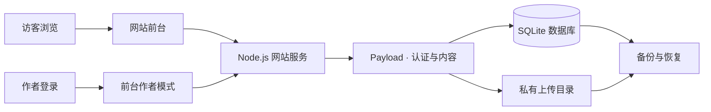

<div align="center">


**记录想法，分享作品，保留探索的轨迹。**

个人博客 · 软件作品 · 资料分享 · 前台作者模式

[](https://github.com/m17639340459gmailcom/sansphase-site/actions/workflows/check.yml)


[使用说明](docs/AUTHOR-GUIDE.md) · [项目结构](ARCHITECTURE.md) · [部署指南](docs/DEPLOYMENT.md) · [发布流程](docs/RELEASE-PROCESS.md)

</div>

## 关于项目

**SANSPHASE / 無相** 是一个以星空、玻璃材质和三维场景为视觉语言的个人网站。访客浏览文章与作品，作者登录后直接在前台编辑、上传和发布，日常操作集中在「作者模式」中。

内容由自托管的 **Payload + SQLite** 保存，网站与后端运行在同一个 Node.js 进程里。前端效果、内容数据与部署配置分别维护，统一从源码构建。

> 当前为 **1.0.0-rc.1 发布候选版**，已部署至 **[www.sansphase.com](https://www.sansphase.com/)**，基础生产验收已通过。公开仓库包含源码和测试，不包含站长账号、私有配置、真实数据库及上传文件。

## 可以做什么

| 场景 | 当前能力 |
| --- | --- |
| 阅读与发现 | 博客文章、标签与搜索、封面和正文阅读 |
| 展示与分享 | 作品、资料、软件推荐、详情介绍与附件下载 |
| 前台创作 | 富文本编辑、文字颜色、表格、封面、草稿、发布与撤回 |
| 个人空间 | 头像、签名、平台主页、公告海报、背景图库与主题配色 |
| 日常组件 | 访客授权定位天气、设备本地时区、日历、音乐上传与音频直链 |
| 内容保护 | 作者认证、公开字段过滤、草稿媒体访问控制、上传检查 |
| 自托管维护 | 构建校验、健康检查、数据库与媒体备份、恢复和部署模板 |

音乐平台分享链接保留跳转入口，酷狗账号歌单尚不支持站内直接播放。有声自动播放受浏览器限制；社区注册和讨论计划在第二阶段建设。

## 网站怎样运行



生产环境在网站服务前使用 Nginx 提供 HTTPS。当前没有启用独立的 Payload 管理面板；作者模式是日常内容管理入口。更详细的职责与数据边界见 [ARCHITECTURE.md](ARCHITECTURE.md)。

## 本地开发与验证

需要 **Node.js 24** 和 **pnpm 11.19.0**，依赖版本通过锁文件固定。

```sh
pnpm install --frozen-lockfile
pnpm build
pnpm test
```

上述构建和测试可以从干净的源码副本执行。集成测试使用隔离的临时数据库，不修改真实文章。

**启动个人网站还需要私有数据。** 此仓库目前面向现有站点的维护与迁移，尚未提供面向其他使用者的一键初始化向导。站长先通过私有备份恢复数据库、媒体和配置，再运行：

```sh
pnpm dev
```

默认本地地址为 `http://127.0.0.1:4176/#/notes`。私有配置默认位于 `.local/payload-env.json`，也可通过 `PAYLOAD_CONFIG_FILE` 指定；缺少配置时会明确报错，不用演示文章替代真实数据。请勿将私有备份提交到仓库。

## 工程地图

```text
src/          页面、组件、主题、前台作者模式
public/       固定公开素材
server/       内容服务、认证、上传、Payload 数据适配
scripts/      构建、启动、备份、恢复与发布检查
tests/        功能测试、集成测试与隔离测试数据
deploy/       Nginx、systemd、环境与定时备份模板
docs/         使用、部署与发布说明
```

`dist/` 为生成产物，不手工修改。真实数据、密钥、本地检查报告及历史实验归档均不纳入公开源码。

## 部署与维护

目标环境是 **Ubuntu 24.04 + Node.js 24 + Nginx**。生产入口为 `pnpm start`，需要 HTTPS 站点地址、生产环境变量和私有配置的绝对路径。具体顺序与回滚方式见 [腾讯云部署指南](docs/DEPLOYMENT.md)。

| 操作 | 命令 / 说明 |
| --- | --- |
| 备份数据库、媒体与配置 | `pnpm cms:backup` |
| 在本机维护作者账号 | `pnpm cms:account` |
| 恢复至全新目录 | `pnpm cms:restore "备份目录" "新数据目录" "新配置文件.json"` |
| 检查服务健康状态 | `pnpm healthcheck` |
| 准备经过扫描的公开源码副本 | `pnpm release:prepare` |

附件与软件安装包上限为 **15 GiB**，图片为 **25 MiB**，音乐为 **100 MiB**。大文件采用流式上传，但尚无断点续传；容量上限不代表服务器磁盘一定足够。空间要求见 [大文件上传说明](docs/UPLOAD-15GB.md)。

## 工程状态与路线图

站点已部署至腾讯云，可通过 **[www.sansphase.com](https://www.sansphase.com/)** 访问。当前软件版本仍标记为 **Release Candidate（发布候选）**，基础上线验收已通过，长期运维能力继续完善。

| 阶段 | 状态 | 范围与验收依据 |
| --- | --- | --- |
| 工程基线 | 已完成 | 统一源码构建入口；运行数据、密钥与测试数据隔离；公开源码清单与敏感信息扫描。 |
| 自动化验证 | 已通过 | 基础版本通过干净副本及 GitHub Ubuntu 构建检查；性能更新在本地和腾讯云 Ubuntu 24.04 完成 154 项测试，0 失败、0 跳过。最新提交的 CI 状态见页面顶部。 |
| 部署准备 | 已提供 | 生产启动与构建完整性校验、Nginx HTTPS 配置、健康检查、备份恢复及回滚文档。 |
| 生产验收 | 基础项已通过 | 腾讯云实机构建及 154 项测试、HTTPS 与备案页脚、进程重启恢复、公开资源和匿名权限检查；无损图片衍生尺寸、缓存校验及原文件完整性检查通过。 |
| 数据保护 | 已启用 | 每日定时备份；隔离恢复验证 16 张表记录数和 12 份附件校验值；首份服务器备份已另存站长本机。 |
| 运维完善 | 待补充 | 持续自动异地备份、备份保留策略、外部可用性与容量告警；大文件存储扩容按实际需求安排。 |
| 后续迭代 | 规划中 | 可索引文章路由、邮件账号恢复、大文件断点续传；社区注册与讨论列入第二阶段。 |

自动化验证结果不等同于生产环境验收。最新构建状态见 [GitHub Actions](https://github.com/m17639340459gmailcom/sansphase-site/actions/workflows/check.yml)，验证范围与已知限制见 [发布候选版记录](docs/RELEASE-PREPARATION-2026-09-15.md)。

## 素材与许可

第三方组件、字体与素材保留各自的许可和来源说明，详见 [THIRD_PARTY_NOTICES.md](THIRD_PARTY_NOTICES.md)。仓库公开用于展示与维护；本项目尚未对全部原创代码和素材统一授予开源许可，复用时请分别核对授权范围。
